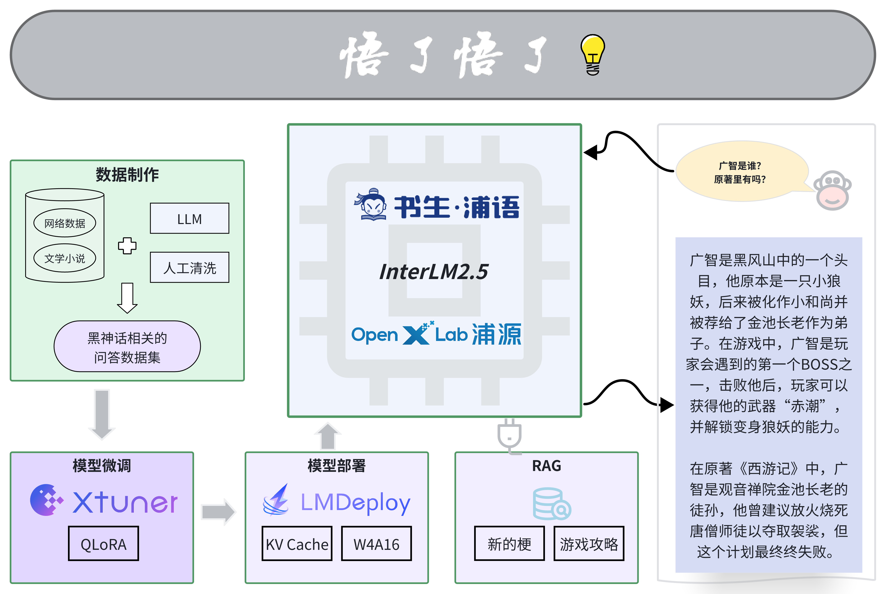

# 🐒悟了悟了🐒 — 《黑神话：悟空》AI助手

<br />
<!-- PROJECT LOGO -->

<p align="center">
  <a href="https://github.com/xzyun2011/wulewule/">
    
  </a>


<h3 align="center"> 悟了悟了</h3>
  <p align="center">
    <br />
    <a href="https://github.com/xzyun2011/wulewule/">查看Demo</a>
    ·
    <a href="https://github.com/xzyun2011/wulewule/issues">报告Bug & 提出新特性</a>
  </p>


## 📜 前言

国产3A游戏《黑神话：悟空》自发布以来，以其精美绝伦的画面、流畅自如的战斗机制、精心雕琢的设计、深厚的文化底蕴等，在全网引发热潮。开发这款“悟了悟了”AI小助手的初衷，是想帮助玩家深入探索游戏的文化内涵，丰富游戏体验。通过解析游戏中的故事情节、角色渊源、与原著的巧妙联系、游戏隐藏细节以及有趣的彩蛋等内容，让玩家更了解游戏背后的中国传统文化，为玩家在酣畅淋漓的战斗之余，带来一场精神上的盛宴。此外，小助手还提供详尽的游戏攻略，助力玩家轻松通关，尽享游戏乐趣。

悟了悟了的模型使用 [xtuner](https://github.com/InternLM/xtuner)在 [InternLM2.5](https://github.com/InternLM/InternLM) 微调得到， 首先在一些网络数据（如《西游记》中英文版、《悟空传》等）上进行**增量预训练**，再基于RAG生成的准确的问答对数据集，基于此数据集进行**QLoRA指令微调**。部署时集成了**RAG**和**LMDeploy 加速推理**

**项目亮点总结：**

1. 📊 基于RAG制作准确实时的新知识数据集
2. 📚 RAG 检索增强生成回答
3. 🚀 KV cache + Turbomind 推理加速


## 🎥 效果图

<video src="assets/wulewulev1_7b_4bit.mp4"></video>

https://github.com/user-attachments/assets/9e01d57a-96a9-4ca6-855c-2128010cd0c7

## 🗂️ 目录
- [📜 前言](#-前言)
- [🎥 图效果图](#-效果图)
- [📊 框架图](#-框架图)
- [🧩 Model Zoo](#-model-zoo)
- [🚀 快速使用](#-快速使用)
  - [💻 本地部署](#-本地部署)
  - [🌐 在线体验](#-在线体验)
- [📖 详细指南](#-详细指南)
  - [🔍 数据集制作](#-数据集制作)
    - [📚 增量预训练数据](#-增量预训练数据)
    - [🤔 自我认知数据](#-自我认知数据)
    - [💬 指令微调数据](#-指令微调数据)
  - [🔄 模型训练](#-模型训练)
  - [🎨 模型量化](#-模型量化)
  - [🔎 RAG(检索增强生成)](#-rag检索增强生成)
- [📅 开发计划](#-开发计划)
  - [🌟 初版功能](#-初版功能)
  - [🤖 后续多模态版本](#-后续多模态版本)
- [🙏 致谢](#-致谢)
- [⚠️ 免责声明](#-免责声明)

---


## 📊 框架图



## 🧩 Model Zoo

| 模型                        | 基座                  | 类型                       | ModelScope(HF)                                               | OpenXLab(HF)                                                 |
| --------------------------- | --------------------- | -------------------------- | ------------------------------------------------------------ | ------------------------------------------------------------ |
| wulewule_v1_1_8b            | internlm2_5_chat_1_8b | 预训练+QLoRA微调           | [wulewule_v1_1_8b](https://modelscope.cn/models/xzyun2011/wulewule_v1_1_8b) | [wulewule_v1_1_8b](https://openxlab.org.cn/models/detail/xzyun2011/wulewule_v1_1_8b) |
| wulewule_v1_1_8b-w4a16-4bit | internlm2_5_chat_1_8b | 预训练+QLoRA微调+w4a16量化 | [wulewule_v1_1_8b-w4a16-4bit](https://modelscope.cn/models/xzyun2011/wulewule_v1_1_8b-w4a16-4bit) | [wulewule_v1_1_8b-w4a16-4bit](https://openxlab.org.cn/models/detail/xzyun2011/wulewule_v1_1_8b-w4a16-4bit) |
| wulewule_v1_7b              | internlm2_5_chat_7b   | 预训练+QLoRA微调           | [wulewule_v1_7b](https://modelscope.cn/models/xzyun2011/wulewule_v1_7b) | [wulewule_v1_7b](https://openxlab.org.cn/models/detail/xzyun2011/wulewule_v1_7b) |
| wulewule_v1_7b-w4a16-4bit   | internlm2_5_chat_7b   | 预训练+QLoRA微调+w4a16量化 | [wulewule_v1_7b-w4a16-4bit](https://modelscope.cn/models/xzyun2011/wulewule_v1_7b-w4a16-4bit) | [wulewule_v1_7b-w4a16-4bit](https://openxlab.org.cn/models/detail/xzyun2011/wulewule_v1_7b-w4a16-4bit) |


## 🚀 快速使用

### 💻 本地部署

```shell
git clone https://github.com/xzyun2011/wulewule.git
cd wulewule
conda create -n wulewule python=3.10.0 -y
conda activate wulewule
conda install pytorch==2.1.2 torchvision==0.16.2 torchaudio==2.1.2 pytorch-cuda=12.1 -c pytorch -c nvidia
pip install -r requirements.txt
apt-get install git-lfs
streamlit run app.py
```

### 🌐 在线体验

制作中...

wulewule_InternLM2-Chat-1_8版体验地址：https://openxlab.org.cn/apps/detail/xzyun2011/wulewule_v1

## 📖 详细指南

### 🔍 数据集制作

数据制作代码讲解见[数据制作流程](data/readme.md)，使用脚本直接制作数据集：

#### 📚 增量预训练数据

将网络收集到的文本数据切分，执行脚本，得到`incremental_pretraining.jsonl`增量预训练数据

```
conda activate wulewule
cd wulewule/data
python3 generate_incremental_pretraining.py --root-path ./ --save-path ./incremental_pretraining.jsonl
```

#### 🤔 自我认知数据**

将`data_utils.py`中的"api_key"换成自己的，执行脚本，将得到`self_cognition.jsonl`自我认知数据

```
python3 generate_selfcognition.py --save-path ./self_cognition.jsonl
```

#### 💬 指令微调数据**

开启茴香豆server服务后，执行脚本，将得到`huixiangdou_conversations.jsonl`准确的问答对数据

```
python3 huixiangdou_rag_QA.py
```

### 🔄 模型训练

训练配置代码讲解见[训练配置](xtuner_config/readme.md)，
🚨其中有个参数需要注意一下：accumulative_counts = 1 #单卡训练切记改成1，不然会有问题，🚨切记切记！！！

命令行直接如下操作：

**QLoRA+deepspeed训练**

```
#增量预训练
xtuner train ./xtuner_config/pretrain/internlm2_5-1_8b-chat_pretrain.py  --work-dir ./pretrain --deepspeed deepspeed_zero1

#指令微调
xtuner train ./xtuner_config/finetune/internlm2_5_chat_1_8b_qlora_wulewule_all_test.py  --work-dir ./finetune --deepspeed deepspeed_zero1
```

**模型转换 + LoRA 合并**

```
export MKL_SERVICE_FORCE_INTEL=1
export MKL_THREADING_LAYER=GNU
##指令微调为例子，先获取最后保存的一个pth文件
pth_file=`ls -t ./finetune/internlm2_5_chat_1_8b_qlora_wulewule_all_test.py/*.pth | head -n 1| sed 's/:$//' `
# 转换格式
xtuner convert pth_to_hf ./internlm2_5_chat_1_8b_qlora_wulewule_all_test.py ${pth_file} ./hf
# 合并参数
xtuner convert merge /root/models/internlm2_5-1_8b-chat ./hf /root/wulewule/models/wulewule_v1_1_8b --max-shard-size 2GB
```

### 🎨 模型量化

使用一下命令对模型采取w4a16量化，更多操作请参考[lmdeploy官网文档](https://lmdeploy.readthedocs.io/en/latest/)

```
lmdeploy lite auto_awq \
   /root/wulewule/models/wulewule_v1_1_8b \
  --calib-dataset 'ptb' \
  --calib-samples 128 \
  --calib-seqlen 2048 \
  --w-bits 4 \
  --w-group-size 128 \
  --batch-size 1 \
  --search-scale False \
  --work-dir /root/wulewule/models/wulewule_v1_1_8b-w4a16-4bit
```

**量化前后速度对比**

| Model                       | Toolkit              | Speed (words/s) |
| --------------------------- | -------------------- | --------------- |
| wulewule_v1_1_8b            | transformer          | 68.0986         |
| wulewule_v1_1_8b-w4a16-4bit | LMDeploy (Turbomind) | 667.8319        |

修改`configs/model_cfg.yaml`文件开启基于lmdeploy的w4a16-4bit模型（默认开启）；`deploy/lmdeploy_model.py`里是一个简单的demo，修改配置后可以直接执行

```
python3 deploy/lmdeploy_model.py
```

### 🔎 RAG(检索增强生成)

默认`data`目录为txt数据源目录，开启RAG后，会使用bce-embedding-base_v1自动将`data`目录下的txt数据转为换chroma向量库数据，存放在`rag/chroma `目录下（如果该目录下已有数据库文件，则跳过数据库创建），然后使用bce-reranker-base_v1对检索到的信息重排序后，将问题和上下文一起给模型得到最终输出。`rag/simple_rag.py`里是一个简单的demo，参数配置见`configs/rag_cfg.yaml`。

RAG代码讲解见[rag配置](rag/readme.md)。


## 📅 开发计划

### 🌟 初版功能

- [x] 游戏角色、背景故事、原著联系等知识问答助手

- [x] 使用RAG支持游戏攻略、菜单、网络梗等新鲜知识的更新

- [x] 基于OpenXLab使用LMDepoly实现初版demo部署

- [ ] 增加history记忆，增加标准测试集，opencompass评估模型性能

### 🤖 后续多模态版本

- [ ] 加入语音多模态，如ASR（用户语音输入）、TTS（猴哥语音回答问题）

- [ ] 加入图像生成，接入别人的[SD+LoRA模型]( https://www.qpipi.com/73996/ )，判断用户意图生成对应prompt的天命人

- [ ] 加入音乐多模态，接类似[SUNO-AI](https://suno-ai.org/)，生成古典风格游戏配乐


## 🙏 致谢

非常感谢以下这些开源项目给予我们的帮助：

- [InternLM](https://github.com/InternLM/InternLM)
- [Xtuner](https://github.com/InternLM/xtuner)
- [Imdeploy](https://github.com/InternLM/lmdeploy)
- [InternlM-Tutorial](https://github.com/InternLM/Tutorial)
- [HuixiangDou](https://github.com/InternLM/HuixiangDou)
- [Streamer-Sales](https://github.com/PeterH0323/Streamer-Sales)

最后感谢上海人工智能实验室推出的书生·浦语大模型实战营，为我们的项目提供宝贵的技术指导和强大的算力支持！

## ⚠️ 免责声明

**本项目相关资源仅供学术研究之用，严禁用于商业用途。** 使用涉及第三方代码的部分时，请严格遵循相应的开源协议。模型生成的内容受模型计算、随机性和量化精度损失等因素影响，本项目不对其准确性作出保证。对于模型输出的任何内容，本项目不承担任何法律责任，亦不对因使用相关资源和输出结果而可能产生的任何损失承担责任。本项目由个人及协作者业余时间发起并维护，因此无法保证能及时回复解决相应问题。
